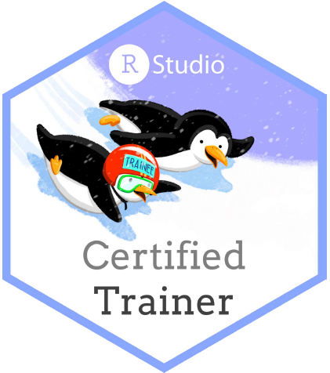
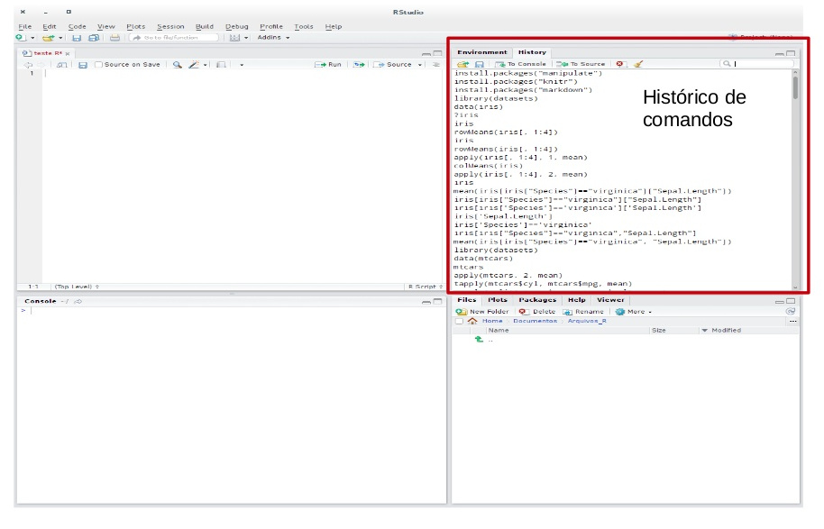
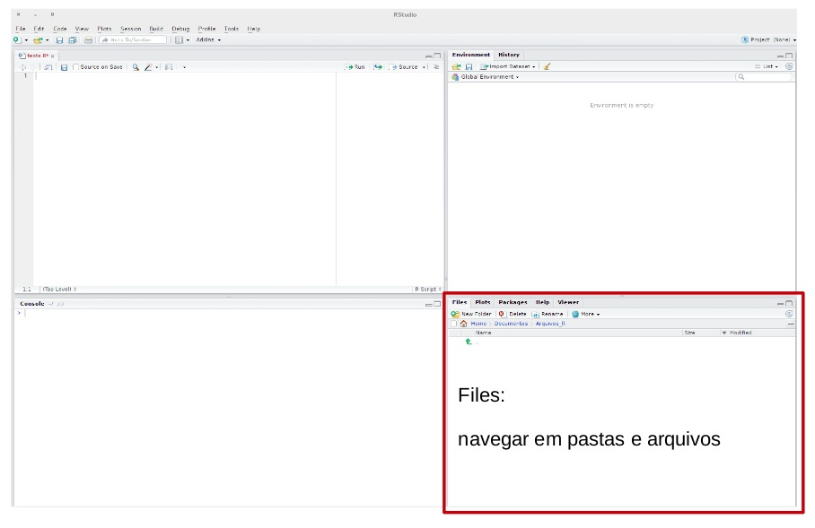
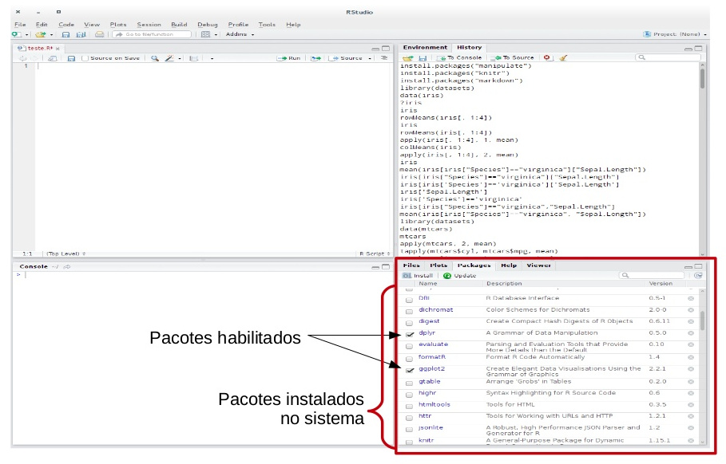

class: middle

```{r setup, include=FALSE}
options(htmltools.dir.version = FALSE)
knitr::opts_chunk$set(
  fig.width = 9,
  fig.height = 3.5,
  fig.retina = 3,
  out.width = "100%",
  cache = FALSE,
  echo = TRUE,
  message = FALSE,
  warning = FALSE,
  hiline = TRUE,
  fig.align = "center"
)
```

```{r eval=FALSE, include=FALSE}
# devtools::install_github("hadley/emo")
# devtools::install_github("gadenbuie/xaringanExtra")
# devtools::install_github("gadenbuie/ermoji")
```

```{css, echo=FALSE}
/* custom.css */
.left-code {
  color: #777;
  width: 38%;
  height: 92%;
  float: left;
}
.right-plot {
  width: 60%;
  float: right;
  padding-left: 1%;
}
```


```{r xaringanExtra-clipboard, echo=FALSE}
xaringanExtra::use_clipboard()
```


```{r xaringan-themer, include=FALSE, warning=FALSE}
library(xaringanthemer)
style_duo_accent(
  primary_color = "#138583",
  title_slide_background_color = "#51B8B6",
  title_slide_text_color = "#FFFFFF",
  inverse_text_color = "#138583",
  inverse_header_color = "#138583",
  inverse_background_color = "#dcf3f2",
  secondary_color = "#EDBBC8",
  
  header_font_google = google_font("Montserrat"),
  text_font_google   = google_font("Work Sans", "300", "300i"),
  code_font_google   = google_font("Source Code Pro"),
  base_font_size = "25px"
)
```

.pull-left[

## Beatriz Milz

- 2019 - * - Doutoranda em Ciência Ambiental - PROCAM/IEE/USP

- 2016-2018 - Mestrado em Ciências - Programa de Pós-Graduação em Análise Ambiental Integrada - UNIFESP

- 2012-2015 - Bacharelado em Gestão Ambiental - EACH/USP 
]

.pull-right[
<BR>
<center>
</center>

]
---
### R: Comunidades, eventos, pacotes, livros..
<center>

<a href='https://education.rstudio.com/trainers/'>  </a>


<a href='https://rladies.org/'>  </a>

<a href='https://curso-r.com/'>  </a>

<a href='https://livro.curso-r.com/'>  </a>


<a href='https://saopaulo2019.satrdays.org/'>  </a>
<a href='https://latin-r.com/'>  </a>
<a href='https://carpentries.org/'>   </a>
<a href='https://user2021.r-project.org/'>   </a>

<a href='https://cienciadedatos.github.io/dados/'>  </a>
<a href='https://beatrizmilz.github.io/mananciais/'>  </a>
</center>


---

## Cronograma

.pull-left[

### Dia 1

- Mais teórico!


```{r, out.width="55%", echo=FALSE}
knitr::include_graphics("https://media.giphy.com/media/HgO7UWoXbkzrW/giphy.gif")
```

]

.pull-right[

### Dia 2

- Mais prático!

```{r, out.width="90%", echo=FALSE}
knitr::include_graphics("https://i.giphy.com/media/aNqEFrYVnsS52/giphy.webp")
```
]


---

## Página do curso


```{r, out.width="80%", echo=FALSE}
xaringanExtra::embed_xaringan("https://beatrizmilz.github.io/2021-senacamb-intro-R/", max_width = "70%")
```

https://beatrizmilz.github.io/2021-senacamb-intro-R/


---
## O que é o R?

> "R é um ambiente de software livre para computação estatística e gráficos". (https://www.r-project.org/)

--

- **Por que usar o R**?

  - É uma linguagem de programação que possui muitas ferramentas para análise de dados

  - É _código aberto_ (open source)

  - Possui uma comunidade ativa de pessoas desenvolvedoras

  - É flexível, permite desenvolver funções e pacotes para facilitar o trabalho 

  - Está disponível, gratuitamente, em diferentes plataformas: Windows, Linux e Mac
    
  - Mantido pela [R Development Core Team](https://cran.r-project.org/)


---
class: middle, center

# As vantagens de analisar dados usando linguagens de programação

.footnote[Slide da [Curso-R](https://curso-r.com/)]
---
class: middle, center

### As principais linguagens de programação para ciência de dados são
## Código Aberto

.footnote[Slide da [Curso-R](https://curso-r.com/)]

---
## O que significa ser código aberto?

<br>

1. Acesso gratuito.

2. Todos podem usar as melhores ferramentas independentemente do poder financeiro.

3. Estudantes podem usar as mesmas ferramentas que profissionais.

4. Você pode corrigir problemas e aprimorar a linguagem.

5. Você pode desenvolver suas próprias ferramentas.

6. Possibilita a existência de uma comunidade ativa.

.footnote[Slide da [Curso-R](https://curso-r.com/)]


---
class: middle, center
## O código é uma linguagem

.footnote[Slide da [Curso-R](https://curso-r.com/)]

---
- Podemos documentar a nossa análise
Slide da [Curso-R](https://curso-r.com/)

```{r message=FALSE, warning=FALSE, include=FALSE}
library(magrittr)
library(magick)
library(ggplot2)
library(dplyr)
library(viridis)
```

```{r frink, eval=TRUE, fig.show='hide'}
image_read("https://jeroen.github.io/images/frink.png") %>%
  image_rotate(270) %>%
  image_background("blue", flatten = TRUE) %>%
  image_border("red", "10x10") %>%
  image_annotate("Linguagens de programação ainda\nsão linguagens!",
                 color = "white", size = 30)
```

--

.pull-left[
#### Entrada

]

--

.pull-right[
#### Saída
```{r frink-out, ref.label="frink", echo=FALSE}

```

]


---
class: middle, center
## O código é texto

.footnote[Slide da [Curso-R](https://curso-r.com/)]

---
## Podemos copiar e colar

<br>
<center>

</center>

.footnote[Slide da [Curso-R](https://curso-r.com/)]

---
class: middle, center

## Por que o R?

.footnote[Slide da [Curso-R](https://curso-r.com/)]

---

## O ciclo da ciência de dados


.footnote[Slide da [Curso-R](https://curso-r.com/)]

---
class: inverse, middle, center

# Como aprender R tem sido importante para mim?


---

## Reprodutibilidade

```{r, out.width="55%", fig.cap="Ilustração por <a href='https://twitter.com/allison_horst'>Allison Horst</a>", echo=FALSE}
knitr::include_graphics("https://github.com/allisonhorst/stats-illustrations/raw/master/rstats-artwork/reproducibility_court.png")
```

---
## Ferramentas antes de R

.pull-left[

- Relatórios e mapas mensais com: 

```{r, out.width="50%", echo=FALSE}
knitr::include_graphics(c("img/pacote-office.jpeg", "img/QGis_Logo.png"))
```


]
.pull-right[


- Sem reprodutibilidade
  
- Demorado
  
- Muito trabalho repetitivo!


]


---


.pull-left[

## Ferramentas com R

```{r, out.width="60%", echo=FALSE}
knitr::include_graphics(c("img/rstats.jpeg", "img/rstudio.png"))
```
]

.pull-right[
```{r, out.width="55%", echo=FALSE}
knitr::include_graphics(c( "img/tidyverse.png", "img/sf.gif"))
```
]

---
## Exemplo: pacote Mananciais


- Preciso dos dados do Portal de Mananciais da SABESP"https://mananciais.sabesp.com.br/Situacao


- Desenvolvi o pacote mananciais para facilitar o acesso à esses dados: https://beatrizmilz.github.io/mananciais/

- Existe uma apresentação específica nesse tema: https://beatrizmilz.com/talk/2021-ser-uff/

---

```{r, out.width="80%", echo=FALSE}
xaringanExtra::embed_xaringan("https://beatrizmilz.github.io/mananciais/", max_width = "100%")
```


---
class: middle, center

```{r echo=FALSE}
# Carregar pacotes
library(ggplot2) # pacote para criar gráficos
library(dplyr) # pacote para manipulação de dados
library(magrittr, include.only = "%>%") # carregar o pipe

# Buscar a base de dados
mananciais <- mananciais::dados_mananciais() 

tabela <- mananciais %>%
  head(7) %>% 
  gt::gt()

tabela
```

---

```{r plot-label-fc, echo=FALSE, fig.width=9, fig.height=5 }
mananciais %>%
  filter(sistema == "Cantareira") %>%
  ggplot() +
  geom_line(aes(x = data, y = volume_porcentagem)) +
  scale_y_continuous(breaks = c(-25, 0, 25, 50, 75, 100)) +
  facet_wrap(~ sistema, ncol = 2) +
  theme_bw() +
  labs(x = "Ano", y = "Volume operacional (%)") +
  ylim(-25, 100)
```


---
class: inverse, middle, center


# RStudio


---

## RStudio

**RStudio** é uma IDE (_integrated development environment_) da Linguagem R, ou seja, um ambiente de desenvolvimento que utilizamos para editar e executar os códigos em R.

```{r echo=FALSE, out.width="700px"}
knitr::include_graphics("img/01-rstudio.png")
```


---
## RStudio

```{r echo=FALSE, out.width="700px"}
knitr::include_graphics("img/haydee1.jpg")
```

Fonte: [Haydee Svab](https://www.slideshare.net/mobile/haydeesvab/anlise-crtica-de-dados-primeiros-passos-com-r)

---

## RStudio

```{r echo=FALSE, out.width="700px"}
knitr::include_graphics("img/haydee2.jpg")
```

Fonte: [Haydee Svab](https://www.slideshare.net/mobile/haydeesvab/anlise-crtica-de-dados-primeiros-passos-com-r)

---

## RStudio

```{r echo=FALSE, out.width="700px"}
knitr::include_graphics("img/haydee3.jpg")
```

Fonte: [Haydee Svab](https://www.slideshare.net/mobile/haydeesvab/anlise-crtica-de-dados-primeiros-passos-com-r)

---


## RStudio

```{r echo=FALSE, out.width="700px"}

```

Fonte: [Haydee Svab](https://www.slideshare.net/mobile/haydeesvab/anlise-crtica-de-dados-primeiros-passos-com-r)

---

## RStudio

```{r echo=FALSE, out.width="700px"}

```

Fonte: [Haydee Svab](https://www.slideshare.net/mobile/haydeesvab/anlise-crtica-de-dados-primeiros-passos-com-r)

---


## RStudio

```{r echo=FALSE, out.width="700px"}
knitr::include_graphics("img/haydee6.jpg")
```

Fonte: [Haydee Svab](https://www.slideshare.net/mobile/haydeesvab/anlise-crtica-de-dados-primeiros-passos-com-r)

---
## RStudio

```{r echo=FALSE, out.width="700px"}

```

Fonte: [Haydee Svab](https://www.slideshare.net/mobile/haydeesvab/anlise-crtica-de-dados-primeiros-passos-com-r)

---
## RStudio
  

```{r echo=FALSE, out.width="700px"}
knitr::include_graphics("img/haydee8.jpg")
```

Fonte: [Haydee Svab](https://www.slideshare.net/mobile/haydeesvab/anlise-crtica-de-dados-primeiros-passos-com-r)


---

### `R` como calculadora

- O `R` permite realizar muitas operações matemáticas!

.pull-left[
```{r}
2 + 5    # adição

9 - 4    # subtração
```
]

.pull-right[
```{r}
5 * 2    # multiplicação

7 / 5    # divisão
```
]

- `CTRL + ENTER`: executa a linha selecionada no script.


---


### `R` como calculadora

```{r}
# oito elevado ao quadrado
8 ^ 2    # potencia

# a raiz quadrada de 1024
sqrt(1024) 
```

A ordem matemática das operações também vale no R.


---

## O que é um objeto?

- Ao se desenvolver um projeto, você irá trabalhar com diversos tipos de arquivos, além de informações que serão repetidas ao longo do script.

- Para reutilizar essas informações ao longo do script utilizamos o que chamamos de **objeto**

- Um objeto retém e representa um valor, função ou base de dados

---

## Atribuindo valor a um objeto no R

- Para atribuir um valor a um objeto no R, utilizamos o operador:
.center[**`<-`**]

.center[`nome_do_objeto <- valor`]

- Atalho: `ALT` + `-`: cria o `<-` sinal de atribuição.

Exemplo:

```{r echo=TRUE}
minha_idade <- 28
minha_idade
```


---

## Exemplo: 

```{r}
nome <- "Daenerys Targaryen"
nome
salario <- 3984.23
salario
ativo <- TRUE
ativo
```


---
## Nomes de objetos

- Os nomes devem começar com uma letra. Podem conter letras, números, _ e .

- Não usar acentuação e espaços nos nomes de objetos.

- Recomendação : **usar_snake_case**, ou seja, palavras escritas em minúsculo separadas pelo underscore (`_`).

- O `R` é *case sensitive*, isto é, faz a diferenciação entre as letras minúsculas e maiúsculas. Portanto, um objeto chamado `teste` é diferente de uma outro objeto chamada `Teste`.

---


## Funções


- Funções permitem __automatizar tarefas__ comuns de forma mais poderosa do que copiar e colar.

- O R possui muitas funções já implementadas.

- Pacotes são coleções de funções, dados e documentação que ampliam as capacidades do R básico. Veremos como instalá-los no final desta atividade!

- Você pode desenvolver suas próprias funções!  `r emo::ji("woman_technologist")`

---

### Exemplo de funções básicas do R 
```{r}
# Combinar elementos - Função c() 
ano_nascimento_irmaos <- c(1993, 1998, 2001, 2012, 2012)
```
--
```{r}
# Podemos fazer operações com o resultado
idade_irmaos <- 2020 - ano_nascimento_irmaos
idade_irmaos
```

--
```{r}
# Calculando a média - Função mean()
media_idade_irmaos <- mean(idade_irmaos)
media_idade_irmaos
```


---

### Estrutura de uma função

- __Nome__ - é como ela fica salva no ambiente, esse nome é importante para usarmos a função.

- __Argumentos__ -  são parâmetros usados internamente pela função. Muitas funções possuem argumentos com valores padrão.


```{r eval=FALSE, include=TRUE}
# para usar essa função
nome_da_funcao(nome_do_argumento = valor_do_argumento)
```

---


  
### Exemplo sobre argumentos

```{r}
# Arredondar valores - função round()
# help(round)
# round(x, digits = 0)

round(media_idade_irmaos)

round(media_idade_irmaos, digits = 1)
```

---

## Funções importantes do R base

|  Função |  O que retorna? |
|--:|--:|
|  `sum()` |  Soma  | 
|  `mean()` |  Média |
|  `median()` |  Mediana |
|  `var()` |  Variância (simples) |
|  `sd()` |  Desvio Padrão |
|  `max()` |  Valor máximo  |
|  `min()` |  Valor mínimo |
|  `round()` |  Valor arredondado |


---

## Help!

- Pedir ajuda: **help**(nome_da_funcao) ou **?**nome_da_funcao.

```{r, eval=FALSE}
help(sum)
?sum
```


- Se a dúvida permanecer, procure no [Stack OverFlow](https://stackoverflow.com/) ou Google.

- E se ainda tiver dúvidas, pergunte para a comunidade (há grupos no Telegram e outras redes sociais).


---
class: middle, center, inverse

# Operadores Relacionais e Lógicos

---
## Operadores Relacionais

- Igual a: **==** 

- Diferente de: **!=** 

- Maior que: **>** 

- Maior ou igual: **>=** 

- Menor que: **<** 

- Menor ou igual: **<=** 

---
##  Operadores Relacionais

Igual a: **==**
```{r}
TRUE == TRUE

TRUE == FALSE
```

---
## Operadores Relacionais

Diferente de **!=**
```{r}
TRUE != TRUE

TRUE != FALSE
```

---

##  Operadores Relacionais
.pull-left[
Menor que: **<**
```{r}
3 < 5
```

Maior que: **>**
```{r}
3 > 5
```
]

.pull-right[

Menor ou igual a: **<=**
```{r}
10 <= 10
```

Maior ou igual a: **>=**
```{r}
10 >= 10
```

]


---

## Operadores Lógicos

- AND - E: **&**

Será verdadeiro se os dois forem verdadeiros (`TRUE`)
.pull-left[
```{r}
x <- 5

 x >= 3 & x <=7
```
]

.pull-right[
```{r}
y <- 2

 y >= 3 & y <= 7
```
]

---


## Operadores Lógicos

- OR - OU: **|**

Será verdadeiro se um dos dois forem verdadeiros (`TRUE`)
.pull-left[
```{r}
y <- 2

 y >= 3 | y <=7
```
]

.pull-right[
```{r}
y <- 1

 y >= 3 | y == 0
```
]


---

## Operadores Lógicos

- NOT - Negação: **!** 


```{r}
!TRUE

!FALSE

x <- 5
(!x < 4)
```


---
class: middle, center, inverse

# Tipos básicos de dados


---

## Tipos básicos de dados

São os tipos básicos de dados que podem ser representados na linguagem R. É neles que guardamos as informações que necessitamos para um algoritmo.

- **Integer**: números inteiros 

- **Double/Numeric**: números racionais 

- **Logical**: tipos lógicos, `TRUE` ou `FALSE` 

- **Character**: texto (sempre entre aspas)

- **Factor**: dados categóricos (não falaremos aqui)


- A função `class()` retorna o tipo do dado.

---
## Números

- Números racionais serão considerados como `double/numeric`: 

```{r}
class(3)
```
```{r}
class(3.1)
```

---
## Lógicos

- Verdadeiro (`TRUE`) ou Falso (`FALSE`)

```{r}
class(TRUE)
```

- O R entende `TRUE` sendo igual a um, e `FALSE` sendo igual a zero. 

- Isso significa que podemos fazer operações matemáticas com eles (como por exemplo somar):

```{r}
TRUE + TRUE + TRUE + FALSE
```

---

##  Textos

- **Qualquer** código entre aspas será interpretado como texto (`character`):

```{r}
class("TEXTO")
```
```{r}
escola <- c("Fundamental", "Médio", "Superior")

class(escola)
```

```{r}
class("3")
```


---

## NA

Uma característica importante do R que pode dificultar a comparação são os valores ausentes ou **NAs** (não disponíveis). 

**NA** representa um valor desconhecido. 

---

## NA

-  Operações envolvendo um valor desconhecido também será desconhecido:

.pull-left[
```{r}
NA > 10
10 == NA
```
]

.pull-right[
```{r}
NA + 10
NA / 2
```
]

---

## NA


```{r}
NA == NA
```


---

## NA

`is.na()` é a função que testa se um objeto é NA.

```{r}
vetor_numerico <- c(NA, 1, 5, 2, 5, NA)

is.na(vetor_numerico)

!is.na(vetor_numerico)

```


---

## Argumento importante: 

### `na.rm = TRUE`

.pull-left[ 
```{r}
sum(vetor_numerico)
sum(vetor_numerico, na.rm = TRUE)
```
]

.pull-right[
```{r}
mean(vetor_numerico)
mean(vetor_numerico, na.rm = TRUE)
```
]
---

## Conversão de classes

Podemos alterar o tipo de dado de um objeto com as funções iniciadas com `as.`:  


- `as.numeric()`

- `as.integer()`

- `as.logical()`

- `as.character()` 

- `as.factor()` 


---

## Conversão de classes

**Exemplos de conversão de classes**

```{r}
vetor_logical <- c(TRUE, FALSE, TRUE, FALSE)

as.integer(vetor_logical)
as.numeric(vetor_logical)
as.character(vetor_logical)
```

---

## Conversão de classes

**Exemplos de conversão de classes**

```{r}
frutas <- c("banana", "maça", "melancia")

as.integer(frutas)
as.numeric(frutas)
as.character(frutas)
```

---
class: middle, center, inverse

# Tipos de objetos


---

## Tipos de objetos

- No R, os 4 principais tipos de dados são: `vetor`, `matriz`, `lista`, `data.frame`

- Vamos focar em dois:  `vetor` e `data.frame`, pois:
  - são os que mais usamos nas tarefas comuns de análise de dados,
  - são conceitos importantes para utilizar o tidyverse.

---
## Vetores

- Armazena elementos de mesma classe, apenas uma dimensão.

- São criados usando a função `c()`

- Exemplo:

```{r}
primeiro_semestre <- c("Janeiro", "Fevereiro", "Março",
                       "Abril", "Maio", "Junho")

```

```{r}
# Retorna o comprimento do vetor - quantos elementos ele tem?
length(primeiro_semestre)
```

---
## Dataframes

- Possuem duas dimensões: linhas e colunas.

- Cada colunas pode ser de classes diferentes.

- Pense em uma tabela, como está acostumada a ver no Excel por exemplo. 


```{r echo=FALSE}
dados::pinguins %>%
  head() %>% 
  knitr::kable()
```

---
class: middle, center, inverse

# Pacotes no R


---
## Pacotes no R

**Pacotes** são coleções de funções, dados e documentação que estendem as capacidades do `R` básico.

Eles precisam ser instalados e carregados.


```{r echo=FALSE, out.width="30%"}
knitr::include_graphics("img/icon-packages.jpg")
```

---
    


## Instalação de Pacotes:

- Via CRAN: 


`install.packages("nome-do-pacote")`

```{r, include=TRUE, eval = FALSE }
install.packages("tidyverse")
```

- Via GitHub:


`devtools::install_github("nome-da-org/nome-do-repo)`

```{r, include=TRUE, eval = FALSE }
devtools::install_github("tidyverse/dplyr")
```

---

## Carregar pacotes:

-  Função: `library(nome-do-pacote)`

```{r, eval=TRUE, message=FALSE}
library(tidyverse)
```


## Dicas sobre Pacotes

1. Você só precisa instalar o pacote uma vez, mas precisa carregá-lo sempre que começar uma nova sessão;

2. Para instalar o pacote use as aspas;  

3. Para carregar o pacote, não é necessário utilizar aspas.


---

## Conheça a comunidade #rstats 

```{r, out.width="40%", fig.cap="Ilustração por <a href='https://twitter.com/allison_horst'>Allison Horst</a>", echo=FALSE}
knitr::include_graphics("img/horst-starwars-hands.png")
```


---
class: center

## Muito obrigada!

.pull-left[

```{r echo=FALSE, fig.align='center', out.width="50%"}
knitr::include_graphics("https://media.giphy.com/media/M9NbzZjAcxq9jS9LZJ/giphy.gif")
```


Slides criados usando os pacotes em R  📦 :

[**xaringan**](https://github.com/yihui/xaringan)<br>
[gadenbuie/xaringanthemer](https://github.com/gadenbuie/xaringanthemer)

O chakra vem da biblioteca javascript [remark.js](https://remarkjs.com), e os pacotes  [**knitr**](http://yihui.name/knitr), e [R Markdown](https://rmarkdown.rstudio.com).
]

.pull-right[

<center>
</center>

<i class="fas fa-home"></i> [beatrizmilz.com](https://beatrizmilz.com)

<i class="fab fa-twitter"></i> [@BeaMilz](https://twitter.com/BeaMilz)

<!-- <i class="far fa-envelope"></i> [milz.bea@gmail.com](mailto:milz.bea@gmail.com) -->
]


<!-- inicio academic icons -->
<link rel="stylesheet" href="https://cdn.jsdelivr.net/gh/jpswalsh/academicons@1/css/academicons.min.css">
<!-- final academic icons -->

 
<!-- inicio font awesome -->
<script src="https://kit.fontawesome.com/1f72d6921a.js" crossorigin="anonymous"></script>

<!-- final font awesome -->
